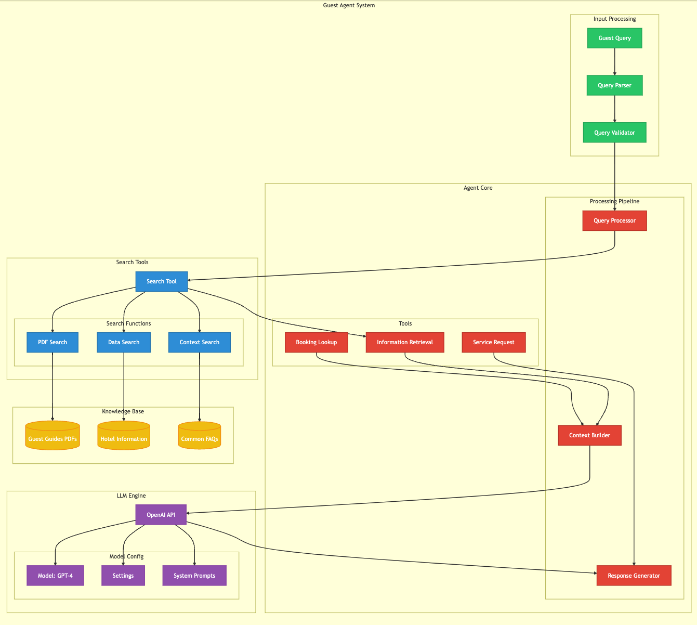
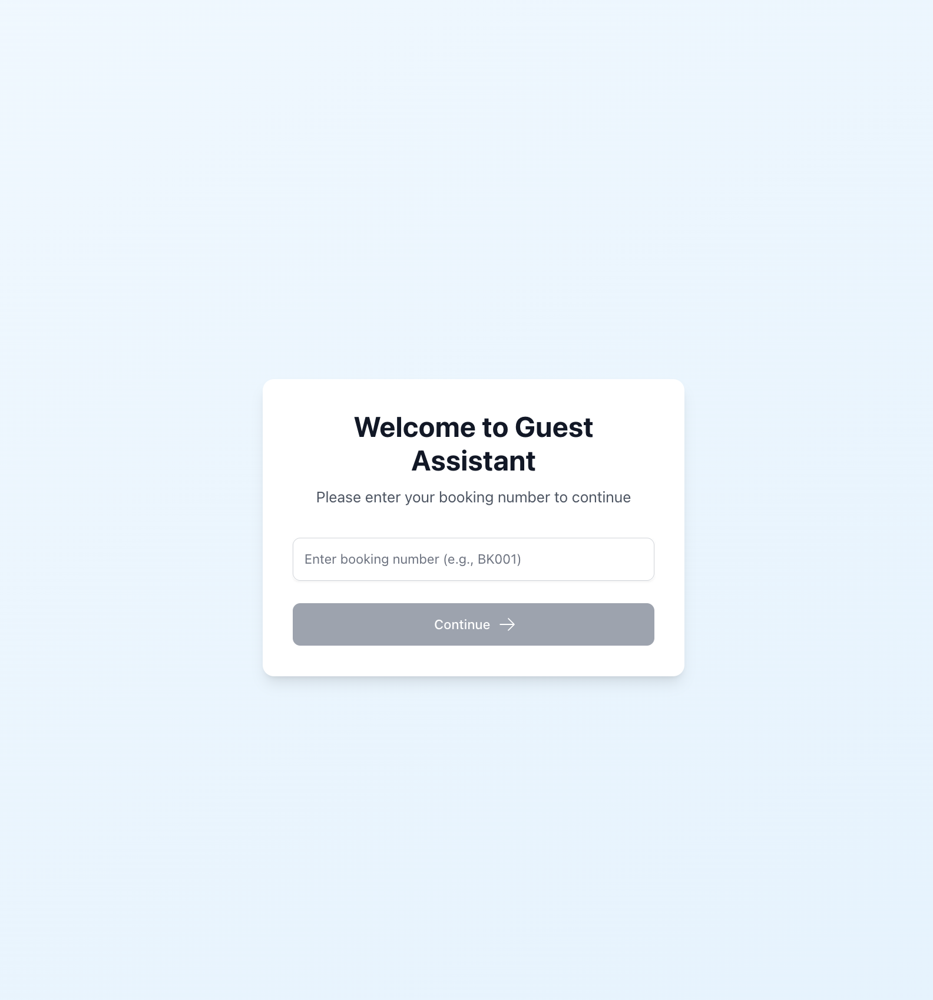
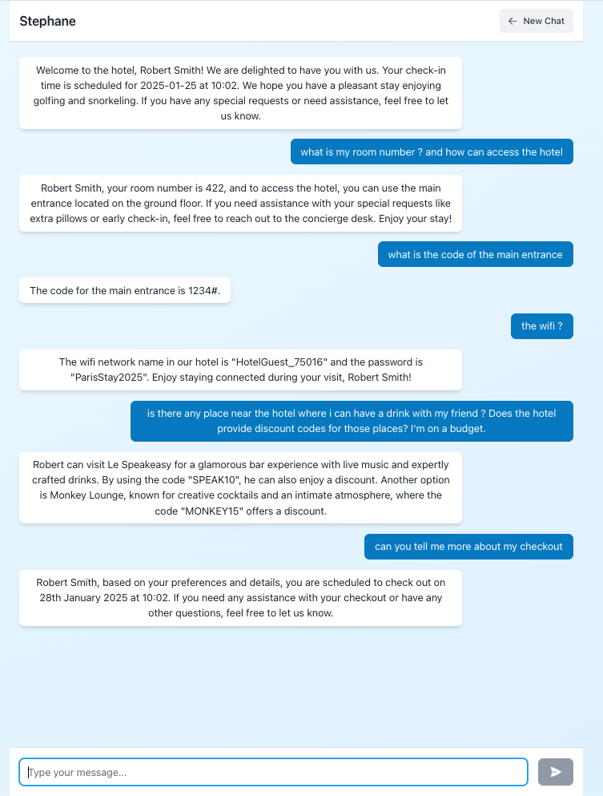

# Guest Assistant AI

Guest Assistant AI is a web application designed to provide personalized assistance to hotel guests. It uses OpenAI's language models to answer guest queries and provide information based on their booking details.

## Screenshots

### Agent System

*Guests Guest Agent System*

## Features

- **Booking Verification**: Guests can enter their booking number to access personalized assistance.
- **Chat Interface**: Once verified, guests can chat with the AI assistant to get information and recommendations.
- **Personalized Responses**: The assistant uses guest booking details to tailor responses.
- **Real-time Updates**: The application supports hot-reloading for both the API and React app during development.

## Project Structure

- **api/**: Contains the Flask API for handling requests and processing guest information.
  - **tools/**: Contains utility classes for searching information and fetching user details.
  - **guest_guides/**: Directory for storing guest guide PDFs.
  - **app.py**: Main application file for the Flask API.
  - **requirements.txt**: Python dependencies for the API.
  - **Dockerfile**: Docker configuration for the API service.

- **react-app/**: Contains the React frontend for the guest interface.
  - **src/**: Source code for the React application.
  - **pages/**: Contains the BookingPage and ChatPage components.
  - **styles/**: CSS files for styling the application.
  - **Dockerfile**: Docker configuration for the React service.

- **docker-compose.yml**: Configuration for running the application with Docker Compose.

## Getting Started

### Prerequisites

- Docker and Docker Compose installed on your machine.

### Installation

1. Clone the repository:

   ```bash
   git clone https://github.com/yourusername/guest-assistant-ai.git
   cd guest-assistant-ai
   ```

2. Set up environment variables:

   - Copy `.env.example` to `.env` in the `api/` directory and fill in your OpenAI API key.

3. Build and run the application:

   ```bash
   docker-compose up --build
   ```

4. Access the application:

   - Open your browser and go to `http://localhost:3000` to access the guest interface.

## Usage

1. **Enter Booking Number**: On the homepage, enter a valid booking number (e.g., BK001) to proceed to the chat interface.
2. **Chat with Assistant**: Ask questions or request information, and the assistant will provide personalized responses based on your booking details.

### Landing Page


*Guests enter their booking number to access personalized assistance*

### Chat Interface


*AI assistant provides personalized responses based on guest information*

## Development

- **Hot Reloading**: The application supports hot-reloading for both the API and React app. Changes to the code will automatically reload the respective service.

## Future Enhancements

Here are some potential future enhancements and features that could be added to the Guest Assistant AI:

- **Multi-language Support**: Enable the assistant to communicate in multiple languages to cater to international guests.
- **Voice Interaction**: Integrate voice recognition and response capabilities for a hands-free experience.
- **Mobile App Integration**: Develop a mobile application to provide on-the-go access to the assistant.
- **Advanced Personalization**: Use machine learning to offer more personalized recommendations based on guest preferences and past interactions.
- **Integration with Hotel Systems**: Connect with hotel management systems for real-time room service, booking modifications, and concierge services.
- **Security Enhancements**: Implement biometric authentication and enhanced data encryption for improved security.
- **Analytics Dashboard**: Provide hotel staff with insights into guest interactions and preferences through an analytics dashboard.

## Contributing

Contributions are welcome! Please fork the repository and submit a pull request for any improvements or bug fixes.

## License

This project is licensed under the MIT License. See the [LICENSE](LICENSE) file for details.

## Acknowledgments

- OpenAI for providing the language models.
- React and Flask communities for their excellent frameworks and tools.

